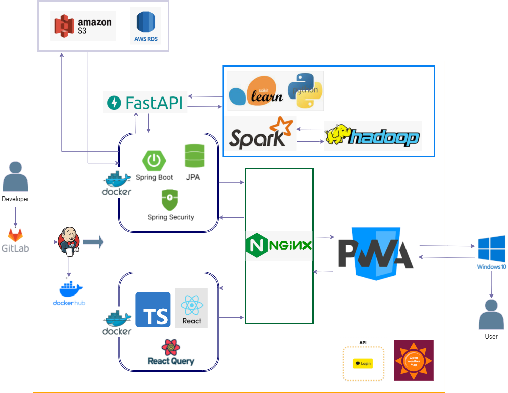
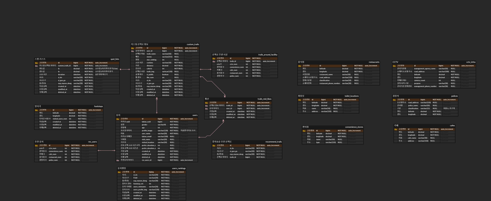

<h1 align="center">🐾 네 발자국 🐾</h1>
<div align="center">
  <a href="https://www.notion.so/1aa7f4a1351d4ce3a22c9a721307db0a?pvs=18" style="text-decoration: none; color: inherit;">
    
  </a>
  <a href="https://www.figma.com/file/l8OuvBhCFlppnRqmiy2a6w/%EB%84%A4%EB%B0%9C%EC%9E%90%EA%B5%AD?type=design&node-id=0-1&mode=design&t=au9X6gy3YyMp3Awn-0" style="text-decoration: none; color: inherit;">
    
  </a>
</div>

## 서비스 소개

```
우리 동네에서 산책할 수 있는 곳이 어디인지 궁금하지 않으셨나요?
산책을 통해 스트레스와 감정적인 어려움을 해소하고 내면의 평화를 찾을 수 있는 소중한 시간을 가져보세요 !

네 발자국은 사용자 맞춤 산책로 추천을 통해 새로운 경험과 발견을 제공하고
사용자들의 활동을 분석하여 “발자국”을 생성하고 획득하는 재미를 통해 산책의 재미를 극대화합니다!

"사용자 맞춤 산책로 추천을 기반으로 한 우리 동네 영역 표시 플랫폼, 네 발자국"
```

- **기간** : 24.02.26 ~ 24.04.05 (6주)
- **트랙** : 빅데이터 (분산)

## 팀원

<div align="middle">
  <table>
    <tr>
      <th colspan='3'>FrontEnd</th>
      <th colspan='3'>BackEnd</th>
    </tr>
    <tr>
      <td height="120px" align="center"> 
        <a href="https://github.com/pangdoon">
          
        </a>
      </td>
      <td height="120px" align="center"> 
        <a href="https://github.com/dreamingbeom">
          
        </a>
      </td>
      <td height="120px" align="center"> 
        <a href="https://github.com/PARK9YUR1">
          
        </a>
      </td>
      <td height="120px" align="center"> 
        <a href="https://github.com/YUNA-AHN">
          
        </a>
      </td>
      <td height="120px" align="center"> 
        <a href="https://github.com/osy9536">
          
        </a>
      </td>
      <td height="120px" align="center"> 
        <a href="https://github.com/Lim-seunghwan99">
          
        </a>
      </td>
    </tr>
    <tr>
      <td align='center'>
        <strong>🐧 김진영(팀장)</strong>
      </td>
      <td align='center'>
        <strong>🤴 김경범</strong>
      </td>
      <td align='center'>
        <strong>🍊 박규리</strong>
      </td>
      <td align='center'>
        <strong>🍀 안유나</strong>
      </td>
      <td align='center'>
        <strong>🏃‍♂️ 오세영</strong>
      </td>
      <td align='center'>
        <strong>😂 임승환</strong>
      </td>
    </tr>
    <tr>
      <td>
        <ul>
          <li>PM</li>
          <li>로그인 UI/UX</li>
          <li>회원가입 UI/UX</li>
          <li>API 구현(회원가입)</li>
          <li>마이페이지 UI/UX</li>
        </ul>
      </td>
      <td>
        <ul>
          <li></li>
          <li></li>
          <li></li>
          <li></li>
          <li></li>
        </ul>
      </td>
      <td>
        <ul>
          <li></li>
          <li></li>
        </ul>
      </td>
      <td>
        <ul>
          <li></li>
          <li></li>
          <li></li>
          <li></li>
          <li></li>
        </ul>
      </td>
      <td>
        <ul>
          <li>Spring Security 적용</li>
          <li>OAuth 적용</li>
          <li>API 구현 ( 프로필 관련, 랭킹 관련, 좋아요, 좌표 </li>찾기)
          <li>랭킹 시스템 알고리즘 구현</li>
          <li>공간 데이터베이스 구성</li>
          <li>공통 응답 api 구현</li>
          <li>공통 에러 api 구현</li>
        </ul>
      </td>
      <td>
        <ul>
          <li>빅데이터 파이프라인 구축</li>
          <li>추천 정보 수집 API</li>
          <li>산책로 시작, 끝 API</li>
          <li>인프라</li>
        </ul>
      </td>
    </tr>
  </table>
</div>

## 기술스택

### Frontend

- Visual Studio Code(IDE) `1.81.1`
- HTML5, CSS3, Javascript(ES6)
- React `18.2.0`
- Vite `5.1.6`
- Typescript `5.2.2`
- Zustand `4.5.2`
- Tanstack React Query `5.28.4`
- emotion CSS `11.11.4`
- Nodejs `20.12.0`

### Backend

- Intellij `2023.3.2`
- JVM OpenJDK `17`
- JWT `0.11.5`
- Spring Boot `3.0.13`
- JAVA Spring Data JPA
- Spring Security
- SSEEmitter
- OAuth `6.0.8`
- Lettuce `6.2.7`
- Gradle
- ORM : JPA
- Python `3.8.10`
- Fastapi `0.110.0`
- Skilearn `1.3.2`

### BigData

- Hadoop `3.3.6`
- Spark `3.4.2`
- pymysql `1.4.6`
- pandas `2.2.1`

### CI/CD

- AWS EC2
  - Nginx `1.18.0`
  - Ubuntu `20.04 LTS`
  - Docker `25.0.4`
  - Jenkins `2.443`
- Docker Hub

## 아키텍처



## ERD



## 주요 기능 및 서비스 화면

<table>
  <tr align="center">  <!-- 기능(1) -->
    <td><strong>회원가입</strong></td>
    <td><strong>메인화면</strong></td>
    <td><strong>산책시작</strong></td>
    <td><strong>기록</strong></td>
  </tr>
  <tr align="center">  <!-- 화면 이미지(1) -->
    <td></td>
    <td></td>
    <td></td>
    <td></td>
  </tr>
  <tr>  <!-- 기능 설명(1) -->
    <td>기능 설명</td>
    <td>기능 설명</td>
    <td>기능 설명</td>
    <td>기능 설명</td>
  </tr>
  <tr align="center">  <!-- 기능(2) -->
    <td><strong>랭킹</strong></td>
    <td><strong>산책목록</strong></td>
    <td><strong>추천산책로</strong></td>
    <td><strong>프로필화면</strong></td>
  </tr>
  <tr align="center">  <!-- 화면 이미지(2) -->
    <td></td>
    <td></td>
    <td></td>
    <td></td>
  </tr>
  <tr>  <!-- 기능 설명(2) -->
    <td>기능 설명</td>
    <td>기능 설명</td>
    <td>기능 설명</td>
    <td>기능 설명</td>
  </tr>
</table>
